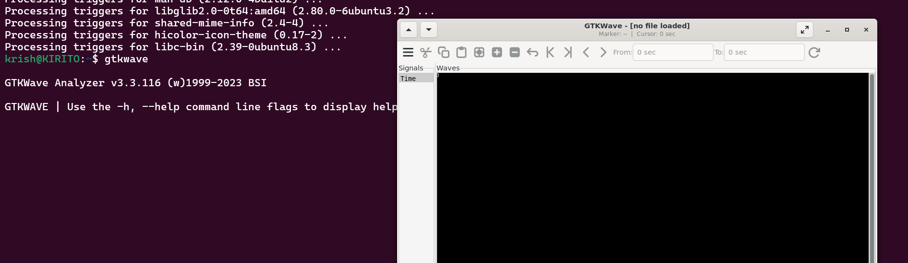

# 🖥️ RISC-V Reference SoC Tapeout Program — VSD  

<div align="center">

[](https://riscv.org/)  
[](https://vsdiat.vlsisystemdesign.com/)  
  
  
  

</div>

Welcome to my journey through the **VSD RISC-V SoC Tapeout Program** 🚀  
This repository will serve as a **week-by-week logbook** where I track my learning, completed tasks, and overall growth.  

The program focuses on taking a design from **RTL all the way to GDSII** using open-source EDA tools, as part of India’s **largest collaborative RISC-V initiative**.  

---

## 📅 Week 0 — Environment Setup & Tools  

### ⚙️ System Requirements
- Minimum **6 GB RAM**  
- **50 GB HDD space**  
- **Ubuntu 20.04+**  
- **4 vCPUs**  

---

### 🖥️ Preparing Ubuntu Display (Guest Additions)
```bash
sudo apt update
sudo apt install build-essential dkms linux-headers-$(uname -r)
cd /media/$USER/VBox_GAs_*/   # Adjust version if different
./autorun.sh


### **TOOL CHECK**

#### <ins>**Yosys**</ins>
```bash
$ sudo apt-get update
$ git clone https://github.com/YosysHQ/yosys.git
$ cd yosys
$ sudo apt install make               # If make is not installed
$ sudo apt-get install build-essential clang bison flex \
    libreadline-dev gawk tcl-dev libffi-dev git \
    graphviz xdot pkg-config python3 libboost-system-dev \
    libboost-python-dev libboost-filesystem-dev zlib1g-dev
$ make config-gcc
# Yosys build depends on a Git submodule called abc, which hasn't been initialized yet. You need to run the following command before running make
$ git submodule update --init --recursive
$ make 
$ sudo make install
```


#### <ins>**Iverilog**</ins>
```bash
$ sudo apt-get update
$ sudo apt-get install iverilog
```


#### <ins>**gtkwave**</ins>
```bash
$ sudo apt-get update
$ sudo apt install gtkwave
```



### ⚡ **4. Ngspice – Circuit Simulator**

<details>
<summary><b>Purpose:</b> Performs analog and mixed-signal circuit simulation.</summary>

Ngspice is a mixed-level/mixed-signal circuit simulator based on Spice3f5, Cider1b1 and Xspice.

</details>

## **Ngspice Installation**
```bash
$ sudo apt update
$ sudo apt install ngspice
```

## 📷 **Installation Verification**


✅ **Ngspice Successfully Installed**

</div>

---

### 🎨 **5. Magic VLSI – Layout Tool**

<details>
<summary><b>Purpose:</b> Creates, edits, and analyzes VLSI layouts with DRC capabilities.</summary>

Magic VLSI is an open-source VLSI layout tool widely used for IC design, DRC, and visualization.

</details>

## ✅ **Magic VLSI Installation**

[Magic VLSI](http://opencircuitdesign.com/magic/) is an open-source VLSI layout tool widely used for IC design, DRC, and visualization.  

Follow the steps below to install Magic on an Ubuntu/Debian system:

```bash
# Install required dependencies
sudo apt-get install m4
sudo apt-get install tcsh
sudo apt-get install csh
sudo apt-get install libx11-dev
sudo apt-get install tcl-dev tk-dev
sudo apt-get install libcairo2-dev
sudo apt-get install mesa-common-dev libglu1-mesa-dev
sudo apt-get install libncurses-dev

# Clone Magic repository
git clone https://github.com/RTimothyEdwards/magic
cd magic

# Configure build
./configure

# Build Magic
make

# Install system-wide
sudo make install
```

## 📷 **Installation Verification**


✅ **Magic VLSI Successfully Installed**

</div>

---

<div align="center">

## 🎉 **Installation Summary**

| Tool | Status | Primary Use |
|------|--------|-------------|
| 🧠 **Yosys** | ✅ Complete | RTL Synthesis |
| 📟 **Iverilog** | ✅ Complete | Verilog Simulation |
| 📊 **GTKWave** | ✅ Complete | Waveform Analysis |
| ⚡ **Ngspice** | ✅ Complete | Circuit Simulation |
| 🎨 **Magic VLSI** | ✅ Complete | Layout Design |

### 🚀 **Environment Ready for VLSI Design Journey!**

</div>

---

<div align="center">


**👨‍💻 Author:** [Krishnendu_Roy](https://github.com/rkrish00568)  
**📚 Program:** VLSI System Design (VSD)


</div>
