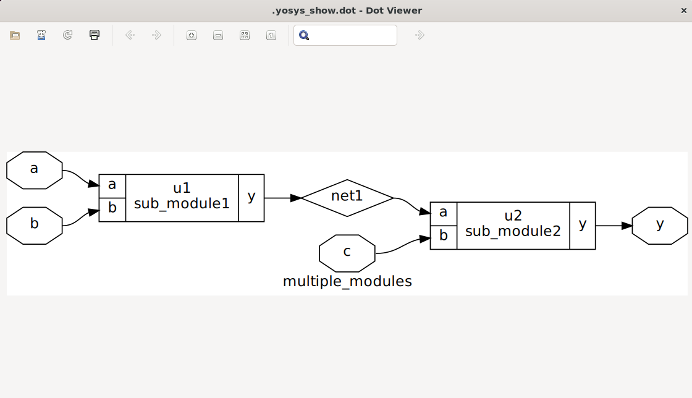
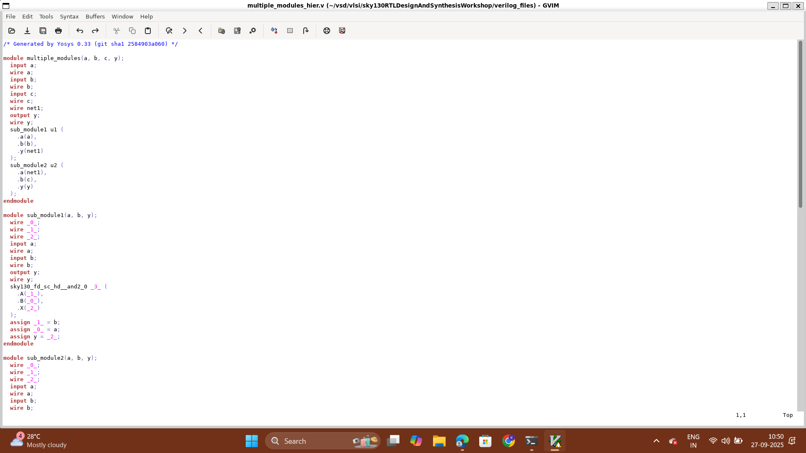
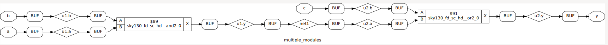
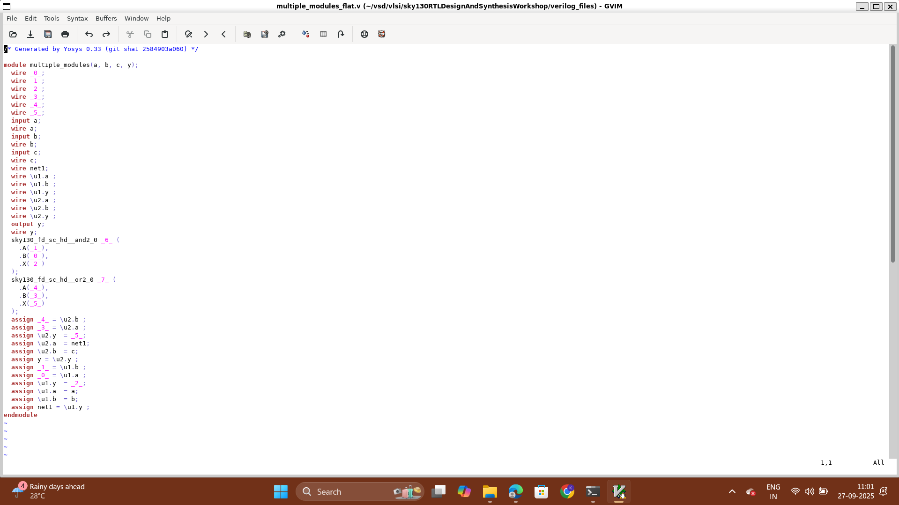
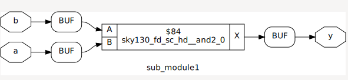

# Day 2: Timing Libs,hierarchical and flat synthesis and efficient flop coding styles

Welcome to Day 2 of the RTL Workshop. This day covers three crucial topics:
- Introduction to timing libs.
- Comparing hierarchical vs. flat synthesis methods.
- Various flop coding styles and optimisation.

---

## Timing Libraries

### SKY130 PDK Overview

The SKY130 PDK is an open-source Process Design Kit based on SkyWater Technology's 130nm CMOS technology. It provides essential models and libraries for integrated circuit (IC) design, including timing, power, and process variation information.

### Decoding tt_025C_1v80 in the SKY130 PDK

- **tt**: Typical process corner.
- **025C**: Represents a temperature of 25°C, relevant for temperature-dependent performance.
- **1v80**: Indicates a core voltage of 1.8V.

This naming convention clarifies which process, voltage, and temperature conditions the library models.

---

# Understanding `.lib` Files in VLSI Design

A `.lib` (Liberty) file is used in digital VLSI design to describe the **characterization of standard cells** (logic gates, flip-flops, etc.).  
It provides **functional, timing, and power information** about each cell so that EDA tools (like synthesis, STA, and power analysis) can use them.

---

## 📌 Key Information Inside a `.lib` File

### 1. General Cell Information
- **Cell name and type** (e.g., `NAND2_X1`, `DFF_X2`)
- **Area** (physical area of the cell)
- **Cell leakage power** (static power when inputs are fixed)
- **Drive strength**

### 2. Pin Information
- **Direction**: input / output / inout
- **Capacitance**: input pin load
- **Function**: Boolean logic equation (e.g., `!(A & B)` for NAND2)
- **Power information**: switching and internal power

### 3. Timing Information
- **Propagation delay** (input → output)
- **Transition time** (rise/fall)
- **Setup / Hold time** (for sequential cells)
- **Clock-to-Q delay** (for flip-flops/latches)

### 4. Power Information
- **Leakage power**: static power
- **Internal power**: power due to internal switching
- **Switching power**: dynamic power due to load capacitance
- **State-dependent power**: varies with input states

---

## Hierarchical vs. Flattened Synthesis

### Hierarchical Synthesis

- **Definition**: Retains the module hierarchy as defined in RTL, synthesizing modules separately.
- **How it Works**: Tools like Yosys process each module independently, using commands such as `hierarchy` to analyze and set up the design structure.

**Advantages:**
- Faster synthesis time for large designs.
- Improved debugging and analysis due to maintained module boundaries.
- Modular approach, aiding integration with other tools.

**Disadvantages:**
- Cross-module optimizations are limited.
- Reporting can require additional configuration.

**Example:**

verilog code::



---

### Flattened Synthesis

- **Definition**: Merges all modules into a single flat netlist, eliminating hierarchy.
- **How it Works**: The `flatten` command in Yosys collapses the hierarchy, allowing whole-design optimizations.

**Advantages:**
- Enables aggressive, cross-module optimizations.
- Results in a unified netlist, sometimes simplifying downstream processes.

**Disadvantages:**
- Longer runtime for large designs.
- Loss of hierarchy complicates debugging and reporting.
- Can increase memory usage and netlist complexity.

**Example:**

verilog code::



> **Important:** Hierarchical synthesis maintains sub-modules in the design, while flattening produces a netlist from the ground up.

---

# Submodule Synthesis in VLSI

When working with RTL designs, you don’t always need to synthesize the **entire chip at once**.  
For large projects, it is often more efficient to use **submodule synthesis**.

---

## 🔹 Multiple Instances of the Same Module
- If a design instantiates the **same submodule multiple times** (e.g., 100 ALUs, many FIFOs, or SRAM wrappers),  
  you don’t need to synthesize each instance separately.  
- Instead:
  1. **Synthesize the submodule once** into a gate-level netlist.  
  2. Reuse the same netlist for every instance.  

👉 This saves **time and resources**, since the synthesis tool doesn’t re-optimize identical logic again and again.

Example: for module 1



---

## 🔹 Divide and Conquer for Massive Designs
When the design is **too large** (millions of gates), flat synthesis becomes impractical:
- Very **long runtimes**
- Huge **memory requirements**
- Difficult **debugging and timing closure**

Instead, use a **divide-and-conquer** approach:
1. **Partition the design** into smaller blocks (e.g., ALU, control unit, memory interface).  
2. **Synthesize each block separately** (block-level synthesis).  
3. **Integrate at the top level** (top-level synthesis), linking the pre-synthesized blocks.  
4. Run **top-level optimization** to handle interconnect timing.

---

### Key Differences

| Aspect                | Hierarchical Synthesis             | Flattened Synthesis           |
|-----------------------|------------------------------------|------------------------------|
| Hierarchy             | Preserved                          | Collapsed                    |
| Optimization Scope    | Module-level only                  | Whole-design                 |
| Runtime               | Faster for large designs           | Slower for large designs     |
| Debugging             | Easier (traces to RTL)             | Harder                       |
| Output Complexity     | Modular structure                  | Single, complex netlist      |
| Use Case              | Modularity, analysis, reporting    | Maximum optimization         |

---


### Why Flip-Flops (FFs) Instead of Only Combinational Circuits?

- **Combinational circuits**:  
  - Output changes immediately with input changes.  
  - Causes **propagation delay** (output settles only after logic levels propagate).  
  - May produce **glitches** (spurious transitions) due to unequal path delays.  

- **Need for storage**:  
  - To stop glitches from directly propagating, we use an element that **stores** the stable value.  
  - **Flip-Flops (FFs) or Latches** are used to hold data until the next clock edge.  

👉 This makes the system **synchronous**, avoids glitches being sampled, and ensures reliable operation.


## Flip-Flop Coding Styles

Flip-flops are fundamental sequential elements in digital design, used to store binary data. Below are efficient coding styles for different reset/set behaviors.

### Asynchronous Reset D Flip-Flop

```verilog
module dff_asyncres (input clk, input async_reset, input d, output reg q);
  always @ (posedge clk, posedge async_reset)
    if (async_reset)
      q <= 1'b0;
    else
      q <= d;
endmodule
```
- **Asynchronous reset**: Overrides clock, setting q to 0 immediately.
- **Edge-triggered**: Captures d on rising clock edge if reset is low.

### Asynchronous Set D Flip-Flop

```verilog
module dff_async_set (input clk, input async_set, input d, output reg q);
  always @ (posedge clk, posedge async_set)
    if (async_set)
      q <= 1'b1;
    else
      q <= d;
endmodule
```
- **Asynchronous set**: Overrides clock, setting q to 1 immediately.

### Synchronous Reset D Flip-Flop

```verilog
module dff_syncres (input clk, input async_reset, input sync_reset, input d, output reg q);
  always @ (posedge clk)
    if (sync_reset)
      q <= 1'b0;
    else
      q <= d;
endmodule
```
- **Synchronous reset**: Takes effect only on the clock edge.

---

## Simulation and Synthesis Workflow

### Icarus Verilog Simulation

1. **Compile:**
   ```shell
   iverilog dff_asyncres.v tb_dff_asyncres.v
   ```
2. **Run:**
   ```shell
   ./a.out
   ```
3. **View Waveform:**
   ```shell
   gtkwave tb_dff_asyncres.vcd
   ```


### Synthesis with Yosys

1. Start Yosys:
   ```shell
   yosys
   ```
2. Read Liberty library:
   ```shell
   read_liberty -lib /address/to/your/sky130/file/sky130_fd_sc_hd__tt_025C_1v80.lib
   ```
3. Read Verilog code:
   ```shell
   read_verilog /path/to/dff_asyncres.v
   ```
4. Synthesize:
   ```shell
   synth -top dff_asyncres
   ```
5. Map flip-flops:
   ```shell
   dfflibmap -liberty /address/to/your/sky130/file/sky130_fd_sc_hd__tt_025C_1v80.lib
   ```
6. Technology mapping:
   ```shell
   abc -liberty /address/to/your/sky130/file/sky130_fd_sc_hd__tt_025C_1v80.lib
   ```
7. Visualize the gate-level netlist:
   ```shell
   show
   ```


---
## Summary
This overview provides you with practical insights into timing libraries, synthesis strategies, and reliable coding practices for flip-flops. Continue experimenting with these concepts to deepen your understanding of RTL design and synthesis.
