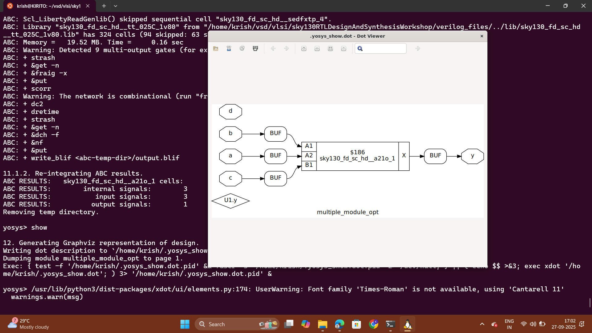

# Day 3: Combinational and Sequential Optimization

Welcome to Day 3 of this workshop! Today we discuss optimization of combinational and sequential circuits, introducing techniques to enhance efficiency and performance.


## 1. Constant Propagation

In VLSI design, constant propagation is a compiler optimization technique used to replace variables with their constant values during synthesis. This can simplify design and enhance performance.

**How it works:**  
Constant propagation analyzes the design code to identify variables with constant values. These are replaced directly, allowing tools to simplify logic and reduce circuit size.

**Benefits:**
- **Reduced Complexity:** Simpler logic, smaller circuit.
- **Performance Improvement:** Faster execution and reduced delays.
- **Resource Optimization:** Fewer gates or flip-flops required.


---

## 2. State Optimization

State optimization refines finite state machines (FSMs) to improve efficiency in IC design. It reduces the number of states, optimizes encoding, and minimizes logic.

**How it is done:**
- **State Reduction:** Merge equivalent states using algorithms.
- **State Encoding:** Assign optimal codes to states.
- **Logic Minimization:** Use Boolean algebra or tools for compact equations.
- **Power Optimization:** Techniques like clock gating reduce dynamic power.

---

## 3. Cloning

Cloning duplicates a logic cell or module to optimize performance, reduce power, or improve timing by balancing load or reducing wire length.

**How it’s done:**
- Identify critical paths using analysis tools.
- Duplicate the target cell/module.
- Redistribute connections to balance load.
- Place and route the cloned cell.
- Verify improvement via timing and power analysis.


---

## 4. Retiming

Retiming is a design optimization technique that improves circuit performance by repositioning registers (flip-flops) without changing functionality.

**How it is done:**
1. **Graph Representation:** Model circuit as a directed graph.
2. **Register Repositioning:** Move registers to balance path delays.
3. **Constraints Analysis:** Maintain timing and functional equivalence.
4. **Optimization:** Adjust register positions to minimize clock period and optimize power.

---

## 5. Boolean Optimisation
In VLSI design, boolean optimization is a technique used to simplify logic expressions by applying boolean algebra rules, Karnaugh maps (K-maps), or logic minimization algorithms. This reduces the overall hardware complexity.  

**How it works:**  
Boolean optimization analyzes logic expressions and removes redundancy. Equivalent but simpler logic is generated, which reduces the number of gates and interconnections.  

**Benefits:**  
- **Reduced Complexity:** Fewer gates and simpler interconnections.  
- **Performance Improvement:** Shorter critical paths, faster logic.  
- **Resource Optimization:** Saves area and power consumption.  
- **Scalability:** Easier to route and integrate in large designs.  

## 6. Sequential Constant Propagation
In VLSI design, sequential constant propagation extends the idea of constant propagation to **sequential circuits** (those with flip-flops and memory elements). If a register or flip-flop always holds a constant value, it can be eliminated or replaced with that constant.  

**How it works:**  
- Tools analyze the **sequential behavior** across clock cycles.  
- If a flip-flop is proven to always be `0` or `1`, its output is replaced by that constant.  
- The flip-flop and its driving logic are removed, simplifying the design.  

**Benefits:**  
- **Reduced Complexity:** Removes unnecessary sequential elements.  
- **Performance Improvement:** Shorter paths, reduced clock load.  
- **Resource Optimization:** Saves area and dynamic power by reducing toggling.  
- **Cleaner Design:** Helps in state machine simplification.  

## 5. Labs on Optimization

### Lab 1

Below is the Verilog code for Lab 1:

```verilog
module opt_check (input a , input b , output y);
	assign y = a?b:0;
endmodule
```

**Explanation:**
- `assign y = a ? b : 0;` means:
  - If `a` is true, `y` is assigned the value of `b`.
  - If `a` is false, `y` is 0.

Follow the steps from Day 1 Synthesis Lab and add the following between `abc -liberty` and `synth -top`:
```shell
opt_clean -purge
```


---

### Lab 2

Verilog code:

```verilog
module opt_check2 (input a , input b , output y);
	assign y = a?1:b;
endmodule
```

**Code Analysis:**
- Acts as a multiplexer:
  - `y = 1` if `a` is true.
  - `y = b` if `a` is false.


---

### Lab 3

Verilog code:

```verilog
module opt_check2 (input a , input b , output y);
	assign y = a?1:b;
endmodule
```

**Functionality:**  
2-to-1 multiplexer; `y = a ? 1 : b` (outputs `1` when `a` is true, otherwise `b`).


---

### Lab 4

Verilog code:

```verilog
module opt_check4 (input a , input b , input c , output y);
 assign y = a?(b?(a & c ):c):(!c);
 endmodule
```

**Functionality:**
- Three inputs (`a`, `b`, `c`), output `y`.
- Nested ternary logic:
  - If `a = 1`, `y = c`.
  - If `a = 0`, `y = !c`.
- Logic simplifies to:  
  `y = a ? c : !c`


---

### Lab 5



---

### Lab 6


---

## Summary
- **Focus:** Optimization techniques for combinational and sequential circuits in digital design, with practical Verilog labs.
  
- **Topics Covered:**
  1. **Constant Propagation:** Replacing variables with constant values to simplify logic and improve circuit efficiency.
  2. **State Optimization:** Reducing states and optimizing encoding in finite state machines to use less logic and power.
  3. **Cloning:** Duplicating logic cells/modules to improve timing and balance load.
  4. **Retiming:** Repositioning registers in a circuit to enhance performance without altering its function.

- **Labs:** Six practical Verilog labs illustrate these concepts, including examples of combinational logic optimizations and D flip-flop behaviors, each with code snippets and output images.
